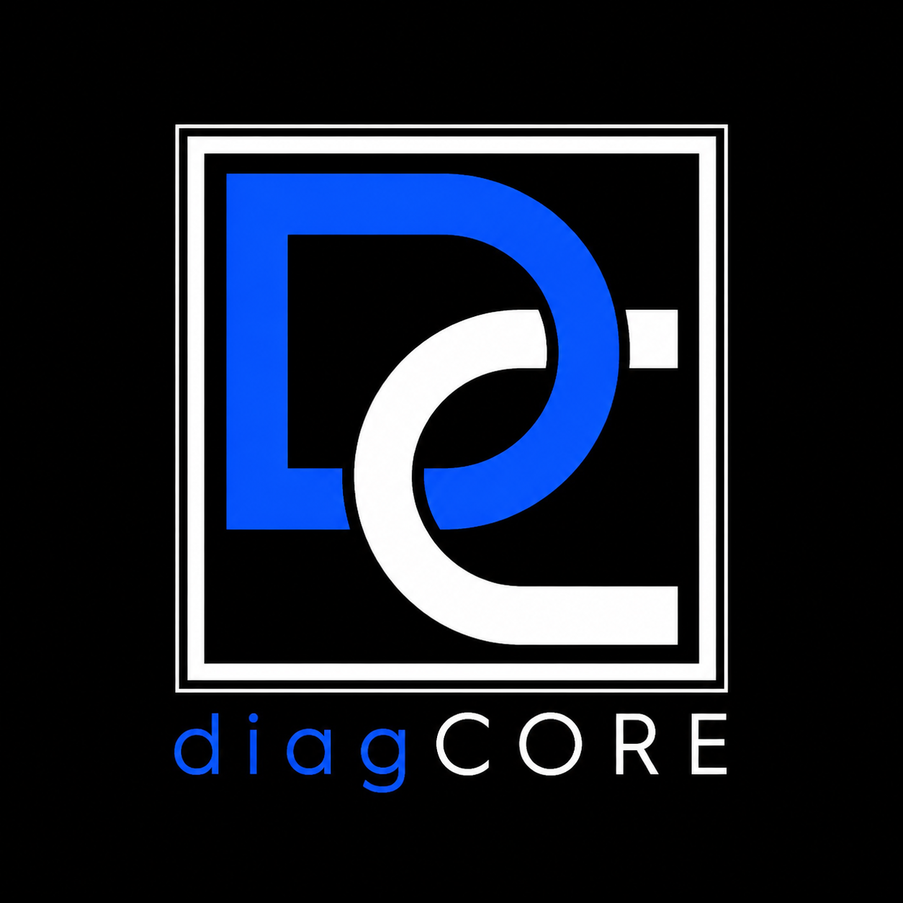

<div align="center">



# DiagCore

**Diagnóstico técnico de sistemas para Windows — moderno, local, open source.**

[](https://github.com/RochyDev/DiagCore/actions/workflows/build.yml)
[](LICENSE)
[](https://dotnet.microsoft.com/download/dotnet/10.0)
[](#requisitos)
[](#roadmap)

</div>

---

## 📖 Sobre el proyecto

**DiagCore** sustituye la ejecución manual de decenas de comandos
(`sfc`, `dism`, `chkdsk`, `Get-PhysicalDisk`, `ipconfig`, `netstat`,
`Get-MpComputerStatus`, ...) por una interfaz moderna, oscura y
profesional que centraliza todo el diagnóstico de un equipo Windows
en un único lugar. Está pensada para administradores de sistemas, IT
helpdesk y MSPs.

> ### 👋 ¿Por qué este proyecto?
>
> Soy **Roger Malgrat Gonzalez** ([@RochyDev](https://github.com/RochyDev))
> y monté DiagCore como **proyecto personal para aprender** WPF, .NET 10,
> patrones MVVM con DI, WMI y todo el flujo de construir una app de
> escritorio de cero hasta una distribución pública. Lo libero como
> **open source (MIT)** por si a alguien más le sirve para aprender
> lo mismo o para tener una alternativa decente a los scripts de
> PowerShell que todos arrastramos.
>
> El producto nació como evolución de un script PowerShell propio
> (`sysadmin-diagnosticador-script`, archivado en
> [`docs/legacy/`](docs/legacy/)) y se ha rehecho desde cero como
> aplicación nativa.

---

## ✨ Características (v0.1.0)

- 🏠 **Dashboard de salud** del equipo con un score 0–100 calculado
  sobre uso de CPU, RAM, disco, estado de Defender y eventos
  críticos de las últimas 24 horas.
- 🖥️ **Hardware**: CPU (modelo, núcleos, carga), RAM total + por
  módulo, GPU(s), BIOS/UEFI con modo de arranque y Secure Boot,
  placa base, batería y sensores ACPI.
- 💾 **Almacenamiento**: volúmenes con barras de uso, discos físicos
  con estado SMART en badge de color, tabla de particiones.
- 🌐 **Red**: adaptadores con IPs, ping interactivo, consulta de IP
  pública opt-in.
- 🛡️ **Seguridad**: estado de Microsoft Defender (RT, antispyware,
  tamper protection), perfiles de firewall, usuarios locales y
  miembros del grupo Administradores.
- 📄 **Informes**: skeleton del wizard de exportación
  (PDF/TXT/JSON — exportación real en la próxima release).
- ⚙️ **Configuración**: información del producto, privacidad,
  bienvenida re-abrible.
- 🎨 **Aspecto** con custom chrome estilo Win11, Mica backdrop,
  paleta oscura propia, tipografía Inter + JetBrains Mono.

### 🔒 Privacidad por diseño

- **Cero telemetría.** El binario no envía nada al autor ni a terceros.
- **Cero cuentas.** No hay login, no hay onboarding remoto.
- **Datos locales.** Informes e histórico se quedan en tu equipo.
- **Única llamada saliente posible**: `api.ipify.org`, y solo si
  pulsas "Consultar IP pública" manualmente.

---

## 🛠️ Stack técnico

| Capa | Tecnología |
|------|------------|
| Lenguaje | C# 14 |
| Runtime | .NET 10 (LTS) |
| UI | WPF + [WPF-UI](https://github.com/lepoco/wpfui) (FluentWindow + Mica) |
| MVVM | [CommunityToolkit.Mvvm](https://github.com/CommunityToolkit/dotnet) |
| DI / Hosting | `Microsoft.Extensions.Hosting` |
| Logging | [Serilog](https://serilog.net/) → archivo local |
| Acceso al sistema | `System.Management` (WMI), Win32 API, registro |
| Tests | xUnit + FluentAssertions |
| CI | GitHub Actions (Windows) |

**Aún por integrar** (ver [Roadmap](#-roadmap)): QuestPDF para
informes PDF, SQLite + EF Core para histórico, Velopack para
auto-update desde GitHub Releases, LiveCharts2 para gráficos
avanzados.

---

## 🚀 Requisitos

- **Windows 10 1809+ / 11 / Server 2019+** · arquitectura x64
- **.NET 10 SDK** — [descargar aquí](https://dotnet.microsoft.com/download/dotnet/10.0)
- **Git**
- **IDE**: Visual Studio 2022 17.10+ · JetBrains Rider · o VS Code con la
  extensión [C# Dev Kit](https://marketplace.visualstudio.com/items?itemName=ms-dotnettools.csdevkit)

> No necesitas privilegios de administrador para construir ni
> ejecutar la app. Algunas funciones del Core (las que llegarán en
> versiones futuras: SFC, DISM, reset de pila de red...) sí los
> requerirán cuando se las invoque.

---

## 🏗️ Setup

### 1. Clona el repositorio

```powershell
git clone https://github.com/RochyDev/DiagCore.git
cd DiagCore
```

### 2. Restaura paquetes

```powershell
dotnet restore DiagCore.slnx
```

### 3. Compila

```powershell
dotnet build DiagCore.slnx
```

Si todo va bien verás `Compilación correcta. 0 Advertencia(s). 0 Errores.`
La solución usa `TreatWarningsAsErrors=true`, así que **un warning rompe el build** —
es intencional.

### 4. Ejecuta la app

```powershell
dotnet run --project src/DiagCore.App
```

### 5. Ejecuta los tests

```powershell
dotnet test
```

Hay **80 tests unitarios** sobre los parsers y mapeos de los
servicios de diagnóstico. Deben pasar todos.

---

## 📁 Estructura del repositorio

```
DiagCore/
├── src/
│   ├── DiagCore.App/      ← WPF: vistas, view models, recursos, custom chrome
│   ├── DiagCore.Core/     ← Lógica de diagnóstico (WMI, Win32) sin UI
│   └── DiagCore.Tests/    ← xUnit + FluentAssertions
├── docs/
│   ├── legacy/            ← El script PowerShell original que originó el proyecto
│   └── screenshots/
├── .github/workflows/     ← CI (Windows · build + test)
├── PLAN.md                ← Documento de arquitectura y fases
├── CHANGELOG.md
├── CONTRIBUTING.md
└── README.md
```

---

## 🗺️ Roadmap

DiagCore se construye por **fases**, cada una con un criterio de
"hecho" antes de avanzar a la siguiente. Más detalle en
[`PLAN.md`](PLAN.md).

| Fase | Estado | Contenido |
|------|--------|-----------|
| 0 — Andamiaje | ✅ | Solución, custom chrome, sistema de diseño |
| 1 — Sistema de diseño y navegación | ✅ | Sidebar, top bar, paleta, fuentes embebidas |
| 2 — Núcleo de diagnóstico | ✅ | 7 servicios WMI + 80 tests |
| 3 — Vistas funcionales | ✅ | Todas las pestañas con datos reales |
| 3.5 — Acciones de reparación | 🔜 | SFC, DISM, chkdsk, reset DNS/red con consola embebida |
| 4 — Informes y persistencia | 🔜 | QuestPDF + SQLite + wizard de exportación |
| 5 — Auto-update y release | 🔜 | Velopack + workflow `release.yml` en GitHub Actions |
| 6 — Pulido y v1.0 | 🔜 | Estados vacíos, splash, icono `.ico`, screenshots, release |

**Próxima entrega previsible**: Fase 3.5 — acciones de reparación con
streaming de stdout en tiempo real (SFC, DISM, chkdsk).

---

## 🤝 Cómo contribuir

¡Las contribuciones son bienvenidas! Si encuentras un bug, tienes
una idea para mejorar una vista o quieres atacar una de las fases
pendientes, mira [`CONTRIBUTING.md`](CONTRIBUTING.md) para el
flujo recomendado.

Resumen rápido:

- Para bugs / sugerencias: abre una [issue](https://github.com/RochyDev/DiagCore/issues).
- Para cambios pequeños: PR directo contra `main`.
- Para cambios grandes: abre primero una issue de propuesta para
  alinear el enfoque antes de programar.

---

## 📚 ¿Quieres aprender con este código?

Algunos puntos que pueden ser útiles si estás empezando con WPF
moderno:

- **`src/DiagCore.Core/Common/WmiQuery.cs`** — wrapper sobre
  `ManagementObjectSearcher` con manejo de disposal y traducción a
  un tipo `DiagnosticResult<T>` (Result pattern sin excepciones).
- **`src/DiagCore.App/App.xaml.cs`** — bootstrap con
  `Microsoft.Extensions.Hosting`, registro de servicios e
  inyección de view models.
- **`src/DiagCore.App/MainWindow.xaml`** — custom chrome
  (sin `ui:TitleBar`), `WindowChrome.IsHitTestVisibleInChrome`
  para los botones de min/max/cerrar, layout con `DockPanel` y
  selección única en sidebar.
- **`src/DiagCore.App/Resources/Themes/`** — paleta, tipografía y
  estilos divididos en `ResourceDictionary`s mergeados al
  arranque.
- **`src/DiagCore.App/Controls/`** — UserControls reusables
  (`KeyValueRow`, `StatTile`, `StatusBadge`) con
  DependencyProperties.

---

## 📜 Licencia

[MIT](LICENSE) © 2026 Roger Malgrat Gonzalez (RochyDev).

Las fuentes embebidas (Inter, JetBrains Mono) están bajo SIL Open
Font License — sus textos se incluyen en
`src/DiagCore.App/Resources/Fonts/`.

---

<div align="center">

**¿Te resulta útil DiagCore o este código te ha enseñado algo?**
Déjame una ⭐ en GitHub.

[Issues](https://github.com/RochyDev/DiagCore/issues) ·
[Releases](https://github.com/RochyDev/DiagCore/releases) ·
[Changelog](CHANGELOG.md)

</div>
